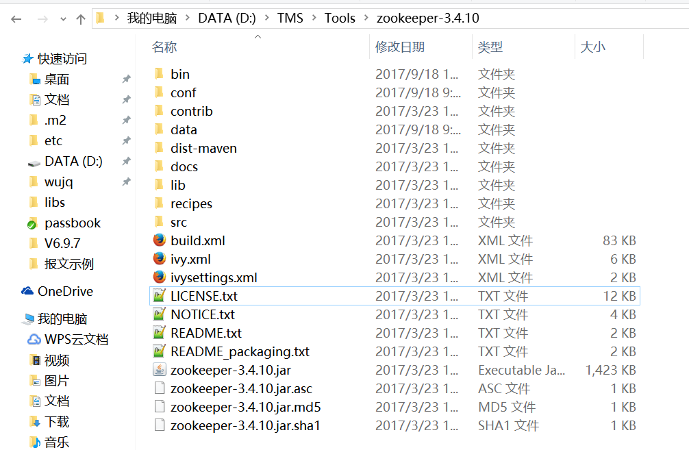

## Win10 ZooKeeper单机版集群配置

此集群采用3个节点
### 环境

* 操作系统：Windows 10
* zookeeper-3.4.10

### 下载

ZooKeeper官方下载地址：[点击这里](http://zookeeper.apache.org/releases.html)

## ZooKeeper根目录

### zoo.cfg配置

> zoo1.cfg

> zoo2.cfg

> zoo3.cfg

### zkServer配置
不能用默认的zkServer启动服务器，因为默认只会加载conf/zoo.cfg配置文件，修改

zkServer配置的目的是为了修改zoo.cfg配置文件。

设置zkServer启动时加载的配置文件：set ZOOCFG=%~dp0%..\conf\zoo3.cfg

> zkServer1.cmd

> zkServer2.cmd

> zkServer3.cmd

### dataDir配置

### myid文件配置
> zoo1的myid文件

> zoo2的myid文件

> zoo3的myid文件

### 环境变量设置

> ZooKeeper环境变量设置

### 启动服务器
先进入ZooKeeper根目录：D:\TMS\Tools\zookeeper-3.4.10

> zkServer1

> zkServer2

> zkServer3

### 使用客户端连接到服务器

> zkCli -server 127.0.0.1:2181

