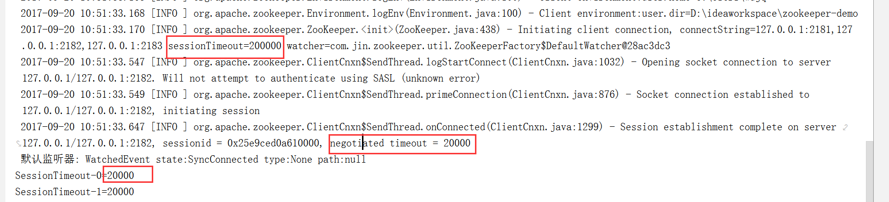
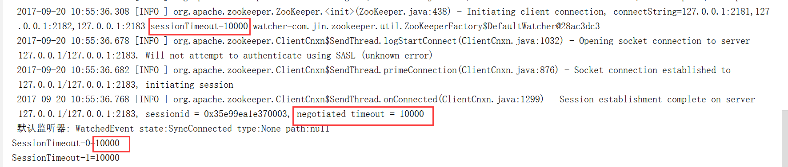

## org.apache.zookeeper.ZooKeeper源码API doc翻译

### public class ZooKeeper
> 这是生成ZooKeeper客户端的主要类，为了使用ZooKeeper服务，你的应用首先需要获得这个
类的一个实例。该类的方法可以反复调用成功，如果没有特别说明这个类的方法是线程安全的，
可以在多线程环境下调用。

> 一旦连接建立成功，服务器将会给客户端分配一个session ID，客户端将会定期的向服务器
端发送心跳检测来确保session不会失效。

> 你的应用可以通过之前实例化出来的ZooKeeper客户端来调用相应的API只要session ID
一直有效。

> 如果客户端由于某种原因，在超过sessionTimeout时间长度内没有成功的向服务器发送心跳
检测包，服务器将会让这个session失效，即session ID也将失效，客户端将不能再继续使用，
如果想调用ZooKeeper API你需要重新实例化出一个新的ZooKeeper客户端对象。

> 如果由于某种原因服务器没有响应客户端，客户端将自动尝试连接到其他可用的服务器(在
session ID失效之前)，如果连接成功应用就可以继续使用。

> ZooKeeper API既有同步的也有异步的，同步的方法将一直阻塞直到服务器端返回了响应，
异步方法只需将请求放入待发送请求列表中就立刻返回。无论是成功还是失败都会执行给定的
回调对象

> 一些ZooKeeper API再成功调用后会给对应的节点添加监听器(watcher), 另一些则会出发
这些监听器。一旦监听器被触发，一个事件(event)将会发送到相应的监听器上，每一个监听器
只能被触发一次，因此多个事件将发送到这个节点的多个监听器上

> 一个客户端实例需要一个监听器对象来处理服务器发送过来的事件。

> 当一个客户端失去了当前的连接或者重新建立连接，所有已存在的触发器(watches)将会被
认为已经被触发(但是为发送的事件将会丢失)， 为了模仿这种情况客户端将会产生一个特殊的
事件(WatchedEvent 事件类型是EventType.None, 事件状态是KeeperState.Disconnected)
来告诉事件处理器连接已断开了。

### public ZooKeeper(String connectString, int sessionTimeout, Watcher watcher)throws IOException
> 为了创建客户端，需要传递一串由逗号分隔的服务器列表，格式：host1:port1,host2:port2...

> Session是建立是异步的，构造方法会开始连接到服务器并立刻返回(通常是在Session完全
建立之前)，监听器只有在构造方法执行完才能生效。

> 客户端实例将会尝试连接到构造方法中提供的服务器列表中的任意一个，如果连接失败，会尝
试连接另一个服务器(服务器的选择是无序的，并不会按照构造方法中参数传递的顺序进行选择)
直到连接建立。如果连接没有成功客户端会一直尝试直到Session关闭(session timeout了)。

> **参数：connectString**
> 格式一：connectString="127.0.0.1:3000,127.0.0.1:3001,127.0.0.1:3002"
> 格式二：connectString="127.0.0.1:3000,127.0.0.1:3001,127.0.0.1:3002/app/a"

格式二是在3.2.0版本中新增的，该格式下客户端将以"/app/a"为根节点，所有节点都是相对于
这个节点的。

> 参数：**sessionTimeout**
> 连接超时时间，单位毫秒

> 参数：**watcher**
> 当状态状态发生变化时，此监听器将会得到相应的通知

>  网络失败(不可用)将抛出IOException异常。

> 指定的跟节点("/app/a")无效将抛出IllegalArgumentException异常。

### public ZooKeeper(String connectString, int sessionTimeout, Watcher watcher, boolean canBeReadOnly) throws IOException
> **同上**
> 参数：**canBeReadOnly**
> (在3.4版本中新增)在分区的情况下是否允许以只读模式创建客户端。当客户端无法连接到
任何主服务器，但可以连上分区服务器，当canBeReadOnly设置为true时，客户端将会以只读
的模式连接到分区服务器上，此时只允许进行读请求，写操作是不允许的(后台线程同时也一直
在尝试连接主服务器)，这种模式可以提高系统的可用性。(在所有主服务器down机后，客户端
还能以只读的方式访问应用)

### public ZooKeeper(String connectString, int sessionTimeout, Watcher watcher, long sessionId, byte[] sessionPasswd) throws IOException
> **同上**
> 参数：**sessionId**
> 指定session id用于重新连接(reconnecting)

> 参数：**sessionPasswd**
> 指定session的密码

### public ZooKeeper(String connectString, int sessionTimeout, Watcher watcher, long sessionId, byte[] sessionPasswd, boolean canBeReadOnly) throws IOException
> **同上**

### public long getSessionId()
> 获取当前客户端的session id，在连接成功建立前这个值是无效的，当重新连接(re-connect)到服务器端时这个值可能发生改变.

> 这个方法是**线程不安全**的

### public byte[] getSessionPasswd()
> 获取当前客户端的session password，在连接成功建立前这个值是无效的，当重新连接
(re-connect)到服务器端时这个值可能发生改变.

> 这个方法是**线程不安全**的

### public int getSessionTimeout()

> 获取negotiated session timeout可能与构造方法中的sessionTimeout的值不一样。
在连接成功建立前这个值是无效的，当重新连接(re-connect)到服务器端时这个值可能发生改变.

> 这个方法是**线程不安全**的

示例1：

示例2：

### public void addAuthInfo(String scheme, byte auth[])
> 向当前连接中添加验证信息(scheme:auth)。

> 这个方法是**线程不安全**的

### public synchronized void register(Watcher watcher)
> 给当前连接指定监听器(watcher)， 此监听器将会替换调在构造方法中指定的那个监听器
(底层赋值到同一个字段)

### public synchronized void close() throws InterruptedException
> 关闭客户端，一旦客户端被关闭，session将会失效，此客户端所创建的所有临时节点
(ephemeral nodes)将会被删除，关联在这些节点及父节点上的所有监听器将会被触发。

> 根据给定的path, data, acl及创建模式(创建临时节点还是持久化节点)创建一个节点

> 当创建临时节点的session失效时，临时节点将会被自动删除。

> 可以通过指定创建模式来创建有顺序的节点, 当创建的节点是有序节点时path将不再是原来的
path，而是(新path = path+由十位数字组成的后缀, 如: my_path0000000001)从1开始
增加，每次增加1。

> 如果节点已存在将抛出KeeperException.NodeExists异常。如果是创建有序节点将永远
不会抛出该异常。

> 如果父节点不存在将抛出KeeperException.NoNode异常 。

> 临时节点不能有子节点，如果给一个临时节点创建子节点将抛出KeeperException.NoChildrenForEphemerals异常。

>
     * If the parent node does not exist in the ZooKeeper, a KeeperException
     * with error code KeeperException.NoNode will be thrown.
     * 

     * An ephemeral node cannot have children. If the parent node of the given
     * path is ephemeral, a KeeperException with error code
     * KeeperException.NoChildrenForEphemerals will be thrown.
     * 

     * This operation, if successful, will trigger all the watches left on the
     * node of the given path by exists and getData API calls, and the watches
     * left on the parent node by getChildren API calls.
     * 

     * If a node is created successfully, the ZooKeeper server will trigger the
     * watches on the path left by exists calls, and the watches on the parent
     * of the node by getChildren calls.
     * 

     * The maximum allowable size of the data array is 1 MB (1,048,576 bytes).
     * Arrays larger than this will cause a KeeperExecption to be thrown.
     *
     * @param path
     *                the path for the node
     * @param data
     *                the initial data for the node
     * @param acl
     *                the acl for the node
     * @param createMode
     *                specifying whether the node to be created is ephemeral
     *                and/or sequential
     * @return the actual path of the created node
     * @throws KeeperException if the server returns a non-zero error code
     * @throws KeeperException.InvalidACLException if the ACL is invalid, null, or empty
     * @throws InterruptedException if the transaction is interrupted
     * @throws IllegalArgumentException if an invalid path is specified
     */
    public String create(final String path, byte data[], List<ACL> acl,
            CreateMode createMode)
        throws KeeperException, InterruptedException
    {
        final String clientPath = path;
        PathUtils.validatePath(clientPath, createMode.isSequential());

        final String serverPath = prependChroot(clientPath);

        RequestHeader h = new RequestHeader();
        h.setType(ZooDefs.OpCode.create);
        CreateRequest request = new CreateRequest();
        CreateResponse response = new CreateResponse();
        request.setData(data);
        request.setFlags(createMode.toFlag());
        request.setPath(serverPath);
        if (acl != null && acl.size() == 0) {
            throw new KeeperException.InvalidACLException();
        }
        request.setAcl(acl);
        ReplyHeader r = cnxn.submitRequest(h, request, response, null);
        if (r.getErr() != 0) {
            throw KeeperException.create(KeeperException.Code.get(r.getErr()),
                    clientPath);
        }
        if (cnxn.chrootPath == null) {
            return response.getPath();
        } else {
            return response.getPath().substring(cnxn.chrootPath.length());
        }
    }

    /**
     * The asynchronous version of create.
     *
     * @see #create(String, byte[], List, CreateMode)
     */

    public void create(final String path, byte data[], List<ACL> acl,
            CreateMode createMode,  StringCallback cb, Object ctx)
    {
        final String clientPath = path;
        PathUtils.validatePath(clientPath, createMode.isSequential());

        final String serverPath = prependChroot(clientPath);

        RequestHeader h = new RequestHeader();
        h.setType(ZooDefs.OpCode.create);
        CreateRequest request = new CreateRequest();
        CreateResponse response = new CreateResponse();
        ReplyHeader r = new ReplyHeader();
        request.setData(data);
        request.setFlags(createMode.toFlag());
        request.setPath(serverPath);
        request.setAcl(acl);
        cnxn.queuePacket(h, r, request, response, cb, clientPath,
                serverPath, ctx, null);
    }

    /**
     * Delete the node with the given path. The call will succeed if such a node
     * exists, and the given version matches the node's version (if the given
     * version is -1, it matches any node's versions).
     * 

     * A KeeperException with error code KeeperException.NoNode will be thrown
     * if the nodes does not exist.
     * 

     * A KeeperException with error code KeeperException.BadVersion will be
     * thrown if the given version does not match the node's version.
     * 

     * A KeeperException with error code KeeperException.NotEmpty will be thrown
     * if the node has children.
     * 

     * This operation, if successful, will trigger all the watches on the node
     * of the given path left by exists API calls, and the watches on the parent
     * node left by getChildren API calls.
     *
     * @param path
     *                the path of the node to be deleted.
     * @param version
     *                the expected node version.
     * @throws InterruptedException IF the server transaction is interrupted
     * @throws KeeperException If the server signals an error with a non-zero
     *   return code.
     * @throws IllegalArgumentException if an invalid path is specified
     */
    public void delete(final String path, int version)
        throws InterruptedException, KeeperException
    {
        final String clientPath = path;
        PathUtils.validatePath(clientPath);

        final String serverPath;

        // maintain semantics even in chroot case
        // specifically - root cannot be deleted
        // I think this makes sense even in chroot case.
        if (clientPath.equals("/")) {
            // a bit of a hack, but delete(/) will never succeed and ensures
            // that the same semantics are maintained
            serverPath = clientPath;
        } else {
            serverPath = prependChroot(clientPath);
        }

        RequestHeader h = new RequestHeader();
        h.setType(ZooDefs.OpCode.delete);
        DeleteRequest request = new DeleteRequest();
        request.setPath(serverPath);
        request.setVersion(version);
        ReplyHeader r = cnxn.submitRequest(h, request, null, null);
        if (r.getErr() != 0) {
            throw KeeperException.create(KeeperException.Code.get(r.getErr()),
                    clientPath);
        }
    }

    /**
     * Executes multiple ZooKeeper operations or none of them.
     * 

     * On success, a list of results is returned.
     * On failure, an exception is raised which contains partial results and
     * error details, see {@link KeeperException#getResults}
     * 

     * Note: The maximum allowable size of all of the data arrays in all of
     * the setData operations in this single request is typically 1 MB
     * (1,048,576 bytes). This limit is specified on the server via
     * <a href="http://zookeeper.apache.org/doc/current/zookeeperAdmin.html#Unsafe+Options">jute.maxbuffer</a>.
     * Requests larger than this will cause a KeeperException to be
     * thrown.
     *
     * @param ops An iterable that contains the operations to be done.
     * These should be created using the factory methods on {@link Op}.
     * @return A list of results, one for each input Op, the order of
     * which exactly matches the order of the <code>ops</code> input
     * operations.
     * @throws InterruptedException If the operation was interrupted.
     * The operation may or may not have succeeded, but will not have
     * partially succeeded if this exception is thrown.
     * @throws KeeperException If the operation could not be completed
     * due to some error in doing one of the specified ops.
     * @throws IllegalArgumentException if an invalid path is specified
     *
     * @since 3.4.0
     */
    public List<OpResult> multi(Iterable<Op> ops) throws InterruptedException, KeeperException {
        for (Op op : ops) {
            op.validate();
        }
        return multiInternal(generateMultiTransaction(ops));
    }

    /**
     * The asynchronous version of multi.
     *
     * @see #multi(Iterable)
     * @since 3.4.7
     */
    public void multi(Iterable<Op> ops, MultiCallback cb, Object ctx) {
        List<OpResult> results = validatePath(ops);
        if (results.size() > 0) {
            cb.processResult(KeeperException.Code.BADARGUMENTS.intValue(),
                             null, ctx, results);
            return;
        }
        multiInternal(generateMultiTransaction(ops), cb, ctx);
    }

    private List<OpResult> validatePath(Iterable<Op> ops) {
        List<OpResult> results = new ArrayList<OpResult>();
        boolean error = false;
        for (Op op : ops) {
            try {
                op.validate();
            } catch (IllegalArgumentException iae) {
                LOG.error("IllegalArgumentException: " + iae.getMessage());
                ErrorResult err = new ErrorResult(
                        KeeperException.Code.BADARGUMENTS.intValue());
                results.add(err);
                error = true;
                continue;
            } catch (KeeperException ke) {
                LOG.error("KeeperException: " + ke.getMessage());
                ErrorResult err = new ErrorResult(ke.code().intValue());
                results.add(err);
                error = true;
                continue;
            }
            ErrorResult err = new ErrorResult(
                    KeeperException.Code.RUNTIMEINCONSISTENCY.intValue());
            results.add(err);
        }
        if (false == error) {
            results.clear();
        }
        return results;
    }

    private MultiTransactionRecord generateMultiTransaction(Iterable<Op> ops) {
        List<Op> transaction = new ArrayList<Op>();

        for (Op op : ops) {
            transaction.add(withRootPrefix(op));
        }
        return new MultiTransactionRecord(transaction);
    }

    private Op withRootPrefix(Op op) {
        if (null != op.getPath()) {
            final String serverPath = prependChroot(op.getPath());
            if (!op.getPath().equals(serverPath)) {
                return op.withChroot(serverPath);
            }
        }
        return op;
    }

    protected void multiInternal(MultiTransactionRecord request, MultiCallback cb, Object ctx) {
        RequestHeader h = new RequestHeader();
        h.setType(ZooDefs.OpCode.multi);
        MultiResponse response = new MultiResponse();
        cnxn.queuePacket(h, new ReplyHeader(), request, response, cb, null, null, ctx, null);
    }

    protected List<OpResult> multiInternal(MultiTransactionRecord request)
        throws InterruptedException, KeeperException {
        RequestHeader h = new RequestHeader();
        h.setType(ZooDefs.OpCode.multi);
        MultiResponse response = new MultiResponse();
        ReplyHeader r = cnxn.submitRequest(h, request, response, null);
        if (r.getErr() != 0) {
            throw KeeperException.create(KeeperException.Code.get(r.getErr()));
        }

        List<OpResult> results = response.getResultList();

        ErrorResult fatalError = null;
        for (OpResult result : results) {
            if (result instanceof ErrorResult && ((ErrorResult)result).getErr() != KeeperException.Code.OK.intValue()) {
                fatalError = (ErrorResult) result;
                break;
            }
        }

        if (fatalError != null) {
            KeeperException ex = KeeperException.create(KeeperException.Code.get(fatalError.getErr()));
            ex.setMultiResults(results);
            throw ex;
        }

        return results;
    }

    /**
     * A Transaction is a thin wrapper on the {@link #multi} method
     * which provides a builder object that can be used to construct
     * and commit an atomic set of operations.
     *
     * @since 3.4.0
     *
     * @return a Transaction builder object
     */
    public Transaction transaction() {
        return new Transaction(this);
    }

    /**
     * The asynchronous version of delete.
     *
     * @see #delete(String, int)
     */
    public void delete(final String path, int version, VoidCallback cb,
            Object ctx)
    {
        final String clientPath = path;
        PathUtils.validatePath(clientPath);

        final String serverPath;

        // maintain semantics even in chroot case
        // specifically - root cannot be deleted
        // I think this makes sense even in chroot case.
        if (clientPath.equals("/")) {
            // a bit of a hack, but delete(/) will never succeed and ensures
            // that the same semantics are maintained
            serverPath = clientPath;
        } else {
            serverPath = prependChroot(clientPath);
        }

        RequestHeader h = new RequestHeader();
        h.setType(ZooDefs.OpCode.delete);
        DeleteRequest request = new DeleteRequest();
        request.setPath(serverPath);
        request.setVersion(version);
        cnxn.queuePacket(h, new ReplyHeader(), request, null, cb, clientPath,
                serverPath, ctx, null);
    }

    /**
     * Return the stat of the node of the given path. Return null if no such a
     * node exists.
     * 

     * If the watch is non-null and the call is successful (no exception is thrown),
     * a watch will be left on the node with the given path. The watch will be
     * triggered by a successful operation that creates/delete the node or sets
     * the data on the node.
     *
     * @param path the node path
     * @param watcher explicit watcher
     * @return the stat of the node of the given path; return null if no such a
     *         node exists.
     * @throws KeeperException If the server signals an error
     * @throws InterruptedException If the server transaction is interrupted.
     * @throws IllegalArgumentException if an invalid path is specified
     */
    public Stat exists(final String path, Watcher watcher)
        throws KeeperException, InterruptedException
    {
        final String clientPath = path;
        PathUtils.validatePath(clientPath);

        // the watch contains the un-chroot path
        WatchRegistration wcb = null;
        if (watcher != null) {
            wcb = new ExistsWatchRegistration(watcher, clientPath);
        }

        final String serverPath = prependChroot(clientPath);

        RequestHeader h = new RequestHeader();
        h.setType(ZooDefs.OpCode.exists);
        ExistsRequest request = new ExistsRequest();
        request.setPath(serverPath);
        request.setWatch(watcher != null);
        SetDataResponse response = new SetDataResponse();
        ReplyHeader r = cnxn.submitRequest(h, request, response, wcb);
        if (r.getErr() != 0) {
            if (r.getErr() == KeeperException.Code.NONODE.intValue()) {
                return null;
            }
            throw KeeperException.create(KeeperException.Code.get(r.getErr()),
                    clientPath);
        }

        return response.getStat().getCzxid() == -1 ? null : response.getStat();
    }

    /**
     * Return the stat of the node of the given path. Return null if no such a
     * node exists.
     * 

     * If the watch is true and the call is successful (no exception is thrown),
     * a watch will be left on the node with the given path. The watch will be
     * triggered by a successful operation that creates/delete the node or sets
     * the data on the node.
     *
     * @param path
     *                the node path
     * @param watch
     *                whether need to watch this node
     * @return the stat of the node of the given path; return null if no such a
     *         node exists.
     * @throws KeeperException If the server signals an error
     * @throws InterruptedException If the server transaction is interrupted.
     */
    public Stat exists(String path, boolean watch) throws KeeperException,
        InterruptedException
    {
        return exists(path, watch ? watchManager.defaultWatcher : null);
    }

    /**
     * The asynchronous version of exists.
     *
     * @see #exists(String, Watcher)
     */
    public void exists(final String path, Watcher watcher,
            StatCallback cb, Object ctx)
    {
        final String clientPath = path;
        PathUtils.validatePath(clientPath);

        // the watch contains the un-chroot path
        WatchRegistration wcb = null;
        if (watcher != null) {
            wcb = new ExistsWatchRegistration(watcher, clientPath);
        }

        final String serverPath = prependChroot(clientPath);

        RequestHeader h = new RequestHeader();
        h.setType(ZooDefs.OpCode.exists);
        ExistsRequest request = new ExistsRequest();
        request.setPath(serverPath);
        request.setWatch(watcher != null);
        SetDataResponse response = new SetDataResponse();
        cnxn.queuePacket(h, new ReplyHeader(), request, response, cb,
                clientPath, serverPath, ctx, wcb);
    }

    /**
     * The asynchronous version of exists.
     *
     * @see #exists(String, boolean)
     */
    public void exists(String path, boolean watch, StatCallback cb, Object ctx) {
        exists(path, watch ? watchManager.defaultWatcher : null, cb, ctx);
    }

    /**
     * Return the data and the stat of the node of the given path.
     * 

     * If the watch is non-null and the call is successful (no exception is
     * thrown), a watch will be left on the node with the given path. The watch
     * will be triggered by a successful operation that sets data on the node, or
     * deletes the node.
     * 

     * A KeeperException with error code KeeperException.NoNode will be thrown
     * if no node with the given path exists.
     *
     * @param path the given path
     * @param watcher explicit watcher
     * @param stat the stat of the node
     * @return the data of the node
     * @throws KeeperException If the server signals an error with a non-zero error code
     * @throws InterruptedException If the server transaction is interrupted.
     * @throws IllegalArgumentException if an invalid path is specified
     */
    public byte[] getData(final String path, Watcher watcher, Stat stat)
        throws KeeperException, InterruptedException
     {
        final String clientPath = path;
        PathUtils.validatePath(clientPath);

        // the watch contains the un-chroot path
        WatchRegistration wcb = null;
        if (watcher != null) {
            wcb = new DataWatchRegistration(watcher, clientPath);
        }

        final String serverPath = prependChroot(clientPath);

        RequestHeader h = new RequestHeader();
        h.setType(ZooDefs.OpCode.getData);
        GetDataRequest request = new GetDataRequest();
        request.setPath(serverPath);
        request.setWatch(watcher != null);
        GetDataResponse response = new GetDataResponse();
        ReplyHeader r = cnxn.submitRequest(h, request, response, wcb);
        if (r.getErr() != 0) {
            throw KeeperException.create(KeeperException.Code.get(r.getErr()),
                    clientPath);
        }
        if (stat != null) {
            DataTree.copyStat(response.getStat(), stat);
        }
        return response.getData();
    }

    /**
     * Return the data and the stat of the node of the given path.
     * 

     * If the watch is true and the call is successful (no exception is
     * thrown), a watch will be left on the node with the given path. The watch
     * will be triggered by a successful operation that sets data on the node, or
     * deletes the node.
     * 

     * A KeeperException with error code KeeperException.NoNode will be thrown
     * if no node with the given path exists.
     *
     * @param path the given path
     * @param watch whether need to watch this node
     * @param stat the stat of the node
     * @return the data of the node
     * @throws KeeperException If the server signals an error with a non-zero error code
     * @throws InterruptedException If the server transaction is interrupted.
     */
    public byte[] getData(String path, boolean watch, Stat stat)
            throws KeeperException, InterruptedException {
        return getData(path, watch ? watchManager.defaultWatcher : null, stat);
    }

    /**
     * The asynchronous version of getData.
     *
     * @see #getData(String, Watcher, Stat)
     */
    public void getData(final String path, Watcher watcher,
            DataCallback cb, Object ctx)
    {
        final String clientPath = path;
        PathUtils.validatePath(clientPath);

        // the watch contains the un-chroot path
        WatchRegistration wcb = null;
        if (watcher != null) {
            wcb = new DataWatchRegistration(watcher, clientPath);
        }

        final String serverPath = prependChroot(clientPath);

        RequestHeader h = new RequestHeader();
        h.setType(ZooDefs.OpCode.getData);
        GetDataRequest request = new GetDataRequest();
        request.setPath(serverPath);
        request.setWatch(watcher != null);
        GetDataResponse response = new GetDataResponse();
        cnxn.queuePacket(h, new ReplyHeader(), request, response, cb,
                clientPath, serverPath, ctx, wcb);
    }

    /**
     * The asynchronous version of getData.
     *
     * @see #getData(String, boolean, Stat)
     */
    public void getData(String path, boolean watch, DataCallback cb, Object ctx) {
        getData(path, watch ? watchManager.defaultWatcher : null, cb, ctx);
    }

    /**
     * Set the data for the node of the given path if such a node exists and the
     * given version matches the version of the node (if the given version is
     * -1, it matches any node's versions). Return the stat of the node.
     * 

     * This operation, if successful, will trigger all the watches on the node
     * of the given path left by getData calls.
     * 

     * A KeeperException with error code KeeperException.NoNode will be thrown
     * if no node with the given path exists.
     * 

     * A KeeperException with error code KeeperException.BadVersion will be
     * thrown if the given version does not match the node's version.
     * 

     * The maximum allowable size of the data array is 1 MB (1,048,576 bytes).
     * Arrays larger than this will cause a KeeperException to be thrown.
     *
     * @param path
     *                the path of the node
     * @param data
     *                the data to set
     * @param version
     *                the expected matching version
     * @return the state of the node
     * @throws InterruptedException If the server transaction is interrupted.
     * @throws KeeperException If the server signals an error with a non-zero error code.
     * @throws IllegalArgumentException if an invalid path is specified
     */
    public Stat setData(final String path, byte data[], int version)
        throws KeeperException, InterruptedException
    {
        final String clientPath = path;
        PathUtils.validatePath(clientPath);

        final String serverPath = prependChroot(clientPath);

        RequestHeader h = new RequestHeader();
        h.setType(ZooDefs.OpCode.setData);
        SetDataRequest request = new SetDataRequest();
        request.setPath(serverPath);
        request.setData(data);
        request.setVersion(version);
        SetDataResponse response = new SetDataResponse();
        ReplyHeader r = cnxn.submitRequest(h, request, response, null);
        if (r.getErr() != 0) {
            throw KeeperException.create(KeeperException.Code.get(r.getErr()),
                    clientPath);
        }
        return response.getStat();
    }

    /**
     * The asynchronous version of setData.
     *
     * @see #setData(String, byte[], int)
     */
    public void setData(final String path, byte data[], int version,
            StatCallback cb, Object ctx)
    {
        final String clientPath = path;
        PathUtils.validatePath(clientPath);

        final String serverPath = prependChroot(clientPath);

        RequestHeader h = new RequestHeader();
        h.setType(ZooDefs.OpCode.setData);
        SetDataRequest request = new SetDataRequest();
        request.setPath(serverPath);
        request.setData(data);
        request.setVersion(version);
        SetDataResponse response = new SetDataResponse();
        cnxn.queuePacket(h, new ReplyHeader(), request, response, cb,
                clientPath, serverPath, ctx, null);
    }

    /**
     * Return the ACL and stat of the node of the given path.
     * 

     * A KeeperException with error code KeeperException.NoNode will be thrown
     * if no node with the given path exists.
     *
     * @param path
     *                the given path for the node
     * @param stat
     *                the stat of the node will be copied to this parameter if
     *                not null.
     * @return the ACL array of the given node.
     * @throws InterruptedException If the server transaction is interrupted.
     * @throws KeeperException If the server signals an error with a non-zero error code.
     * @throws IllegalArgumentException if an invalid path is specified
     */
    public List<ACL> getACL(final String path, Stat stat)
        throws KeeperException, InterruptedException
    {
        final String clientPath = path;
        PathUtils.validatePath(clientPath);

        final String serverPath = prependChroot(clientPath);

        RequestHeader h = new RequestHeader();
        h.setType(ZooDefs.OpCode.getACL);
        GetACLRequest request = new GetACLRequest();
        request.setPath(serverPath);
        GetACLResponse response = new GetACLResponse();
        ReplyHeader r = cnxn.submitRequest(h, request, response, null);
        if (r.getErr() != 0) {
            throw KeeperException.create(KeeperException.Code.get(r.getErr()),
                    clientPath);
        }
        if (stat != null) {
            DataTree.copyStat(response.getStat(), stat);
        }
        return response.getAcl();
    }

    /**
     * The asynchronous version of getACL.
     *
     * @see #getACL(String, Stat)
     */
    public void getACL(final String path, Stat stat, ACLCallback cb,
            Object ctx)
    {
        final String clientPath = path;
        PathUtils.validatePath(clientPath);

        final String serverPath = prependChroot(clientPath);

        RequestHeader h = new RequestHeader();
        h.setType(ZooDefs.OpCode.getACL);
        GetACLRequest request = new GetACLRequest();
        request.setPath(serverPath);
        GetACLResponse response = new GetACLResponse();
        cnxn.queuePacket(h, new ReplyHeader(), request, response, cb,
                clientPath, serverPath, ctx, null);
    }

    /**
     * Set the ACL for the node of the given path if such a node exists and the
     * given version matches the version of the node. Return the stat of the
     * node.
     * 

     * A KeeperException with error code KeeperException.NoNode will be thrown
     * if no node with the given path exists.
     * 

     * A KeeperException with error code KeeperException.BadVersion will be
     * thrown if the given version does not match the node's version.
     *
     * @param path
     * @param acl
     * @param version
     * @return the stat of the node.
     * @throws InterruptedException If the server transaction is interrupted.
     * @throws KeeperException If the server signals an error with a non-zero error code.
     * @throws org.apache.zookeeper.KeeperException.InvalidACLException If the acl is invalide.
     * @throws IllegalArgumentException if an invalid path is specified
     */
    public Stat setACL(final String path, List<ACL> acl, int version)
        throws KeeperException, InterruptedException
    {
        final String clientPath = path;
        PathUtils.validatePath(clientPath);

        final String serverPath = prependChroot(clientPath);

        RequestHeader h = new RequestHeader();
        h.setType(ZooDefs.OpCode.setACL);
        SetACLRequest request = new SetACLRequest();
        request.setPath(serverPath);
        if (acl != null && acl.size() == 0) {
            throw new KeeperException.InvalidACLException(clientPath);
        }
        request.setAcl(acl);
        request.setVersion(version);
        SetACLResponse response = new SetACLResponse();
        ReplyHeader r = cnxn.submitRequest(h, request, response, null);
        if (r.getErr() != 0) {
            throw KeeperException.create(KeeperException.Code.get(r.getErr()),
                    clientPath);
        }
        return response.getStat();
    }

    /**
     * The asynchronous version of setACL.
     *
     * @see #setACL(String, List, int)
     */
    public void setACL(final String path, List<ACL> acl, int version,
            StatCallback cb, Object ctx)
    {
        final String clientPath = path;
        PathUtils.validatePath(clientPath);

        final String serverPath = prependChroot(clientPath);

        RequestHeader h = new RequestHeader();
        h.setType(ZooDefs.OpCode.setACL);
        SetACLRequest request = new SetACLRequest();
        request.setPath(serverPath);
        request.setAcl(acl);
        request.setVersion(version);
        SetACLResponse response = new SetACLResponse();
        cnxn.queuePacket(h, new ReplyHeader(), request, response, cb,
                clientPath, serverPath, ctx, null);
    }

    /**
     * Return the list of the children of the node of the given path.
     * 

     * If the watch is non-null and the call is successful (no exception is thrown),
     * a watch will be left on the node with the given path. The watch willbe
     * triggered by a successful operation that deletes the node of the given
     * path or creates/delete a child under the node.
     * 

     * The list of children returned is not sorted and no guarantee is provided
     * as to its natural or lexical order.
     * 

     * A KeeperException with error code KeeperException.NoNode will be thrown
     * if no node with the given path exists.
     *
     * @param path
     * @param watcher explicit watcher
     * @return an unordered array of children of the node with the given path
     * @throws InterruptedException If the server transaction is interrupted.
     * @throws KeeperException If the server signals an error with a non-zero error code.
     * @throws IllegalArgumentException if an invalid path is specified
     */
    public List<String> getChildren(final String path, Watcher watcher)
        throws KeeperException, InterruptedException
    {
        final String clientPath = path;
        PathUtils.validatePath(clientPath);

        // the watch contains the un-chroot path
        WatchRegistration wcb = null;
        if (watcher != null) {
            wcb = new ChildWatchRegistration(watcher, clientPath);
        }

        final String serverPath = prependChroot(clientPath);

        RequestHeader h = new RequestHeader();
        h.setType(ZooDefs.OpCode.getChildren);
        GetChildrenRequest request = new GetChildrenRequest();
        request.setPath(serverPath);
        request.setWatch(watcher != null);
        GetChildrenResponse response = new GetChildrenResponse();
        ReplyHeader r = cnxn.submitRequest(h, request, response, wcb);
        if (r.getErr() != 0) {
            throw KeeperException.create(KeeperException.Code.get(r.getErr()),
                    clientPath);
        }
        return response.getChildren();
    }

    /**
     * Return the list of the children of the node of the given path.
     * 

     * If the watch is true and the call is successful (no exception is thrown),
     * a watch will be left on the node with the given path. The watch willbe
     * triggered by a successful operation that deletes the node of the given
     * path or creates/delete a child under the node.
     * 

     * The list of children returned is not sorted and no guarantee is provided
     * as to its natural or lexical order.
     * 

     * A KeeperException with error code KeeperException.NoNode will be thrown
     * if no node with the given path exists.
     *
     * @param path
     * @param watch
     * @return an unordered array of children of the node with the given path
     * @throws InterruptedException If the server transaction is interrupted.
     * @throws KeeperException If the server signals an error with a non-zero error code.
     */
    public List<String> getChildren(String path, boolean watch)
            throws KeeperException, InterruptedException {
        return getChildren(path, watch ? watchManager.defaultWatcher : null);
    }

    /**
     * The asynchronous version of getChildren.
     *
     * @see #getChildren(String, Watcher)
     */
    public void getChildren(final String path, Watcher watcher,
            ChildrenCallback cb, Object ctx)
    {
        final String clientPath = path;
        PathUtils.validatePath(clientPath);

        // the watch contains the un-chroot path
        WatchRegistration wcb = null;
        if (watcher != null) {
            wcb = new ChildWatchRegistration(watcher, clientPath);
        }

        final String serverPath = prependChroot(clientPath);

        RequestHeader h = new RequestHeader();
        h.setType(ZooDefs.OpCode.getChildren);
        GetChildrenRequest request = new GetChildrenRequest();
        request.setPath(serverPath);
        request.setWatch(watcher != null);
        GetChildrenResponse response = new GetChildrenResponse();
        cnxn.queuePacket(h, new ReplyHeader(), request, response, cb,
                clientPath, serverPath, ctx, wcb);
    }

    /**
     * The asynchronous version of getChildren.
     *
     * @see #getChildren(String, boolean)
     */
    public void getChildren(String path, boolean watch, ChildrenCallback cb,
            Object ctx)
    {
        getChildren(path, watch ? watchManager.defaultWatcher : null, cb, ctx);
    }

    /**
     * For the given znode path return the stat and children list.
     * 

     * If the watch is non-null and the call is successful (no exception is thrown),
     * a watch will be left on the node with the given path. The watch willbe
     * triggered by a successful operation that deletes the node of the given
     * path or creates/delete a child under the node.
     * 

     * The list of children returned is not sorted and no guarantee is provided
     * as to its natural or lexical order.
     * 

     * A KeeperException with error code KeeperException.NoNode will be thrown
     * if no node with the given path exists.
     *
     * @since 3.3.0
     *
     * @param path
     * @param watcher explicit watcher
     * @param stat stat of the znode designated by path
     * @return an unordered array of children of the node with the given path
     * @throws InterruptedException If the server transaction is interrupted.
     * @throws KeeperException If the server signals an error with a non-zero error code.
     * @throws IllegalArgumentException if an invalid path is specified
     */
    public List<String> getChildren(final String path, Watcher watcher,
            Stat stat)
        throws KeeperException, InterruptedException
    {
        final String clientPath = path;
        PathUtils.validatePath(clientPath);

        // the watch contains the un-chroot path
        WatchRegistration wcb = null;
        if (watcher != null) {
            wcb = new ChildWatchRegistration(watcher, clientPath);
        }

        final String serverPath = prependChroot(clientPath);

        RequestHeader h = new RequestHeader();
        h.setType(ZooDefs.OpCode.getChildren2);
        GetChildren2Request request = new GetChildren2Request();
        request.setPath(serverPath);
        request.setWatch(watcher != null);
        GetChildren2Response response = new GetChildren2Response();
        ReplyHeader r = cnxn.submitRequest(h, request, response, wcb);
        if (r.getErr() != 0) {
            throw KeeperException.create(KeeperException.Code.get(r.getErr()),
                    clientPath);
        }
        if (stat != null) {
            DataTree.copyStat(response.getStat(), stat);
        }
        return response.getChildren();
    }

    /**
     * For the given znode path return the stat and children list.
     * 

     * If the watch is true and the call is successful (no exception is thrown),
     * a watch will be left on the node with the given path. The watch willbe
     * triggered by a successful operation that deletes the node of the given
     * path or creates/delete a child under the node.
     * 

     * The list of children returned is not sorted and no guarantee is provided
     * as to its natural or lexical order.
     * 

     * A KeeperException with error code KeeperException.NoNode will be thrown
     * if no node with the given path exists.
     *
     * @since 3.3.0
     *
     * @param path
     * @param watch
     * @param stat stat of the znode designated by path
     * @return an unordered array of children of the node with the given path
     * @throws InterruptedException If the server transaction is interrupted.
     * @throws KeeperException If the server signals an error with a non-zero
     *  error code.
     */
    public List<String> getChildren(String path, boolean watch, Stat stat)
            throws KeeperException, InterruptedException {
        return getChildren(path, watch ? watchManager.defaultWatcher : null,
                stat);
    }

    /**
     * The asynchronous version of getChildren.
     *
     * @since 3.3.0
     *
     * @see #getChildren(String, Watcher, Stat)
     */
    public void getChildren(final String path, Watcher watcher,
            Children2Callback cb, Object ctx)
    {
        final String clientPath = path;
        PathUtils.validatePath(clientPath);

        // the watch contains the un-chroot path
        WatchRegistration wcb = null;
        if (watcher != null) {
            wcb = new ChildWatchRegistration(watcher, clientPath);
        }

        final String serverPath = prependChroot(clientPath);

        RequestHeader h = new RequestHeader();
        h.setType(ZooDefs.OpCode.getChildren2);
        GetChildren2Request request = new GetChildren2Request();
        request.setPath(serverPath);
        request.setWatch(watcher != null);
        GetChildren2Response response = new GetChildren2Response();
        cnxn.queuePacket(h, new ReplyHeader(), request, response, cb,
                clientPath, serverPath, ctx, wcb);
    }

    /**
     * The asynchronous version of getChildren.
     *
     * @since 3.3.0
     *
     * @see #getChildren(String, boolean, Stat)
     */
    public void getChildren(String path, boolean watch, Children2Callback cb,
            Object ctx)
    {
        getChildren(path, watch ? watchManager.defaultWatcher : null, cb, ctx);
    }

    /**
     * Asynchronous sync. Flushes channel between process and leader.
     * @param path
     * @param cb a handler for the callback
     * @param ctx context to be provided to the callback
     * @throws IllegalArgumentException if an invalid path is specified
     */
    public void sync(final String path, VoidCallback cb, Object ctx){
        final String clientPath = path;
        PathUtils.validatePath(clientPath);

        final String serverPath = prependChroot(clientPath);

        RequestHeader h = new RequestHeader();
        h.setType(ZooDefs.OpCode.sync);
        SyncRequest request = new SyncRequest();
        SyncResponse response = new SyncResponse();
        request.setPath(serverPath);
        cnxn.queuePacket(h, new ReplyHeader(), request, response, cb,
                clientPath, serverPath, ctx, null);
    }

    public States getState() {
        return cnxn.getState();
    }

    /**
     * String representation of this ZooKeeper client. Suitable for things
     * like logging.
     *
     * Do NOT count on the format of this string, it may change without
     * warning.
     *
     * @since 3.3.0
     */
    @Override
    public String toString() {
        States state = getState();
        return ("State:" + state.toString()
                + (state.isConnected() ?
                        " Timeout:" + getSessionTimeout() + " " :
                        " ")
                + cnxn);
    }

    /*
     * Methods to aid in testing follow.
     *
     * THESE METHODS ARE EXPECTED TO BE USED FOR TESTING ONLY!!!
     */

    /**
     * Wait up to wait milliseconds for the underlying threads to shutdown.
     * THIS METHOD IS EXPECTED TO BE USED FOR TESTING ONLY!!!
     *
     * @since 3.3.0
     *
     * @param wait max wait in milliseconds
     * @return true iff all threads are shutdown, otw false
     */
    protected boolean testableWaitForShutdown(int wait)
        throws InterruptedException
    {
        cnxn.sendThread.join(wait);
        if (cnxn.sendThread.isAlive()) return false;
        cnxn.eventThread.join(wait);
        if (cnxn.eventThread.isAlive()) return false;
        return true;
    }

    /**
     * Returns the address to which the socket is connected. Useful for testing
     * against an ensemble - test client may need to know which server
     * to shutdown if interested in verifying that the code handles
     * disconnection/reconnection correctly.
     * THIS METHOD IS EXPECTED TO BE USED FOR TESTING ONLY!!!
     *
     * @since 3.3.0
     *
     * @return ip address of the remote side of the connection or null if
     *         not connected
     */
    protected SocketAddress testableRemoteSocketAddress() {
        return cnxn.sendThread.getClientCnxnSocket().getRemoteSocketAddress();
    }

    /**
     * Returns the local address to which the socket is bound.
     * THIS METHOD IS EXPECTED TO BE USED FOR TESTING ONLY!!!
     *
     * @since 3.3.0
     *
     * @return ip address of the remote side of the connection or null if
     *         not connected
     */
    protected SocketAddress testableLocalSocketAddress() {
        return cnxn.sendThread.getClientCnxnSocket().getLocalSocketAddress();
    }

    private static ClientCnxnSocket getClientCnxnSocket() throws IOException {
        String clientCnxnSocketName = System
                .getProperty(ZOOKEEPER_CLIENT_CNXN_SOCKET);
        if (clientCnxnSocketName == null) {
            clientCnxnSocketName = ClientCnxnSocketNIO.class.getName();
        }
        try {
            return (ClientCnxnSocket) Class.forName(clientCnxnSocketName)
                    .newInstance();
        } catch (Exception e) {
            IOException ioe = new IOException("Couldn't instantiate "
                    + clientCnxnSocketName);
            ioe.initCause(e);
            throw ioe;
        }
    }
}
