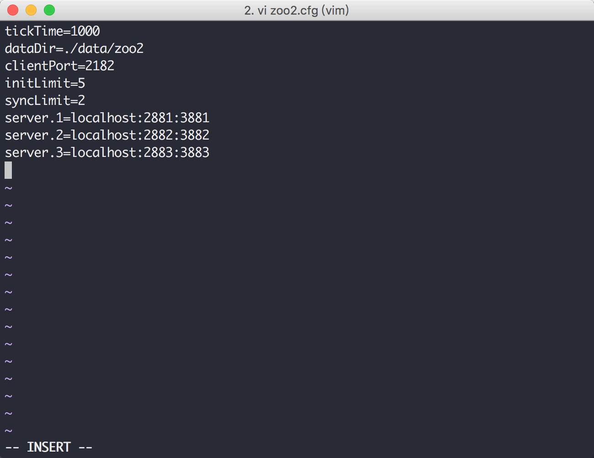
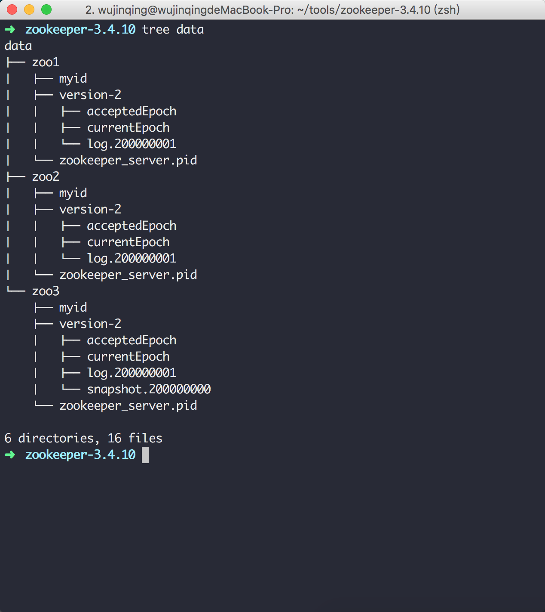
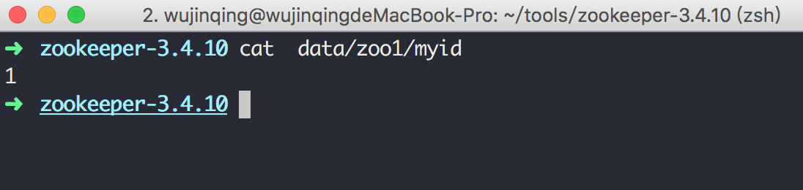
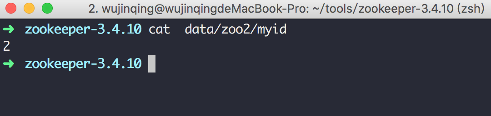
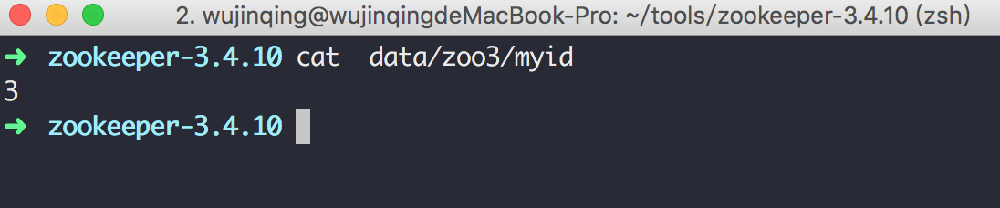

## ZooKeeper单机版集群配置
此集群采用3个节点

### zoo.cfg配置
> zoo1.cfg

> zoo2.cfg

> zoo3.cfg

### dataDir配置

### myid文件配置
> zoo1的myid文件

> zoo2的myid文件

> zoo3的myid文件

### 启动服务器

> ./bin/zkServer.sh start ./conf/zoo1.cfg

> ./bin/zkServer.sh start ./conf/zoo2.cfg

> ./bin/zkServer.sh start ./conf/zoo3.cfg

### 使用客户端连接到服务器

> ./bin/zkCli.sh -server 127.0.0.1:2181

### 查看服务器状态即是Leader还是Follower

> ./bin/zkServer.sh status ./conf/zoo1.cfg

### 注意事项

> 1. 由于是在单机环境中所以zoo.cfg配置文件中dataDir与clientPort两项配置在3个服务中各不相同。

> 2. 各自的myid不能相同，myid的值对应zoo.cfg配置项server.1=localhost:2881:3881中server.myid=ip:Leader和Follower通信的端口:Leader选举的端口

