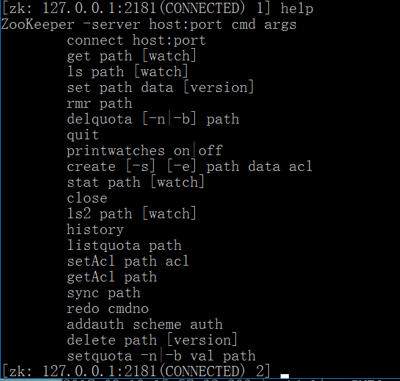

## ZooKeeper基本命令

ZooKeeper支持的所有命令

### 命令列表
#### create
> creates a node at a location in the tree

> 创建一个节点

#### delete
> deletes a node

> 删除一个节点

#### exists
> tests if a node exists at a location

> 判断节点是否存在

#### get data
> reads the data from a node

> 读取节点的数据

#### set data
> writes data to a node

> 设置节点的数据

#### get children
> retrieves a list of children of a node

> 获取子节点

#### sync
> waits for data to be propagated

> 等待数据传播, 加锁